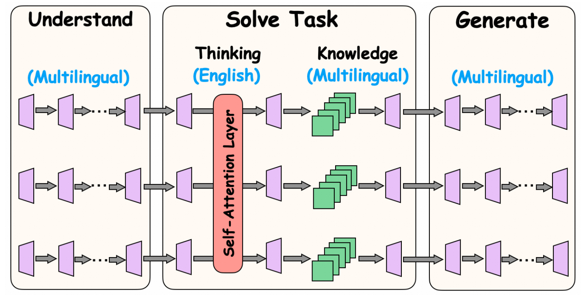
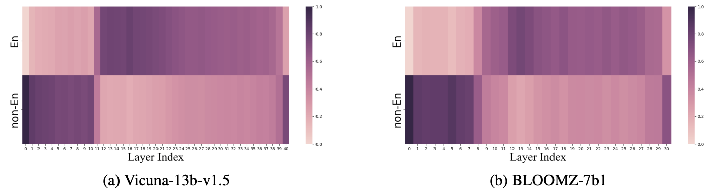

# [NeurIPS 2024] How do Large Language Models Handle Multilingualism?

This repository contains code for the paper "[How do Large Language Models Handle Multilingualism?](https://arxiv.org/abs/2402.18815)". Below is our hypothesized multilingual workflow MWork.



## Layer Embedding Decoding

### Installation

The package can be installed by running the following command at the root of this repository: 

```shell
conda create -n SeaExam python=3.9
conda activate Layers
pip install -r requirement.txt
```

### Running

Figure 1 in the paper is obtained by decoding the embedding by decoding the hidden embeddings of each layer to tokens within the LLM’s vocabulary. Specifically, codes are in `./layer`, where the `test_layer.py` is the function while for other files you need to **change transformers package**. Use the following command to run the experiment.

```sh
cd layers
python test_layer.py
```

### Parameters

1. **Model layers**

   **Note that you need to change `candidate_premature_layers` and `candidate_langs` in  `test_layer.py`; `early_exit_layers` of `./transformers/models/{model_name}/modeling_{model_name}.py` and `early_exit_layers`  in `./generation/utils.py`, to corresponding layer index list.** For example, for llama3, ``candidate_premature_layers`` must be set as

   ```python
   candidate_premature_layers = [0,1,2,3,4,5,6,7,8,9,10,11,12,13,14,15,16,17,18,19,20,21,22,23,24,25,26,27,28,29,30,31]
   ```

2. **Top-k tokens**

   To keep the generalization of decoded tokens, we normally decode top-k tokens on each position, which is set as follows in `/generation/utils.py`

   ```python
   topk_values, topk_indices = torch.topk(logit, 100, dim=-1)
   ```



## Neuron Detection (PLND) 

We provide codes for detecting neurons in Llama, Mistral and Gemma.

### Installation

The package can be installed by running the following command at the root of this repository: 

```shell
conda create -n SeaExam python=3.9
conda activate Neuron
pip install -r requirement.txt
```

### Running

Detect corpus is stored in `./neuron_detection/corpus_all`, while similar to previous settings, we need to  **change transformers package**. When detecting, we need to define the language and number of documents used to detect. Detected neurons will be stored in folder `./output_neurons`.

```sh
cd /neuron_detection
python neuron_detection.py english 1000
```

### Parameters

**Number of Top-k neurons in each layer**

```python
top_number_attn = 1000
top_number_ffn = 2000
```

## Neuron Deactivation

We provide codes for detecting neurons in Llama, Mistral and Gemma.

### Installation

The package can be installed by running the following command at the root of this repository: 

```shell
conda create -n SeaExam python=3.9
conda activate Deactivate
pip install -r requirement.txt
```

### Running

We need to  **change transformers package**. 

```sh
cd /neuron_deactivate
python test_mistral_gsm.py {language} {understanding layer} {generation layer} {attn deact_number} {ffn deact_number} {whether under_attn} {whether reason_attn} {whether gen_attn} {whether under_ffn} {whether reason_ffn} {whether gen_ffn}
```

## Neuron Specific Enhancement

Neuron specific tuning code is the same for all models.

### Installation

The package can be installed by running the following command at the root of this repository: 

```shell
conda create -n SeaExam python=3.9
conda activate Enhance
pip install -r requirement.txt
```

### Running

We need to  **change transformers package**. 

```sh
cd /neuron_enhancement
python train_neuron.py
```

### Parameters

Note that `attn_k` and `attn_v` needs to be  divided by `kv_repeat`. `index_keys` requires fitting to model you want to train and number of understanding layer and generation layer needs to be changed correspondingly.

```python
index_keys = [0,1,2,3,4,5,6,7,8,9,10,11,12,13,14,15,16,17,18,19,20,21,22,23,24,25,26,27,28,29,30,31]         

index_keys_under = [i for i in range(8)]
index_keys_gen = [31-i for i in range(4)]

attn_k = {key: {num//4 for num in value} for key, value in attn_k.items()}
attn_v = {key: {num//4 for num in value} for key, value in attn_v.items()}
```

## Citation

If you found this repository useful, please consider

```latex
@inproceedings{zhao2024large,
  title={How do Large Language Models Handle Multilingualism?},
  author={Zhao, Yiran and Zhang, Wenxuan and Chen, Guizhen and Kawaguchi, Kenji and Bing, Lidong},
  booktitle={Advances in Neural Information Processing Systems (NeurIPS)},
  year={2024}
}
```
